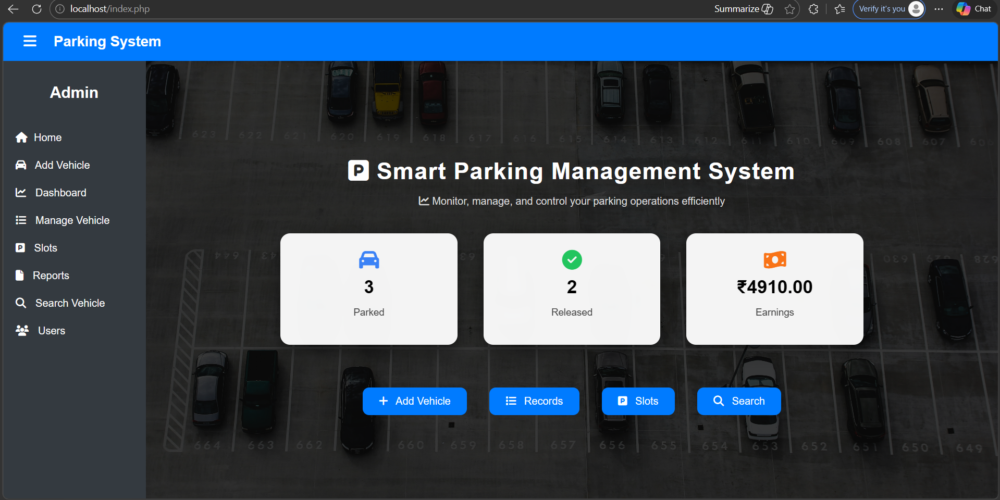
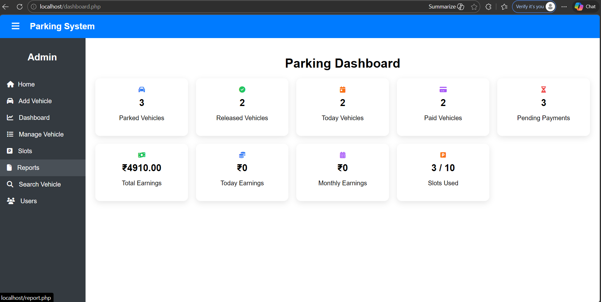
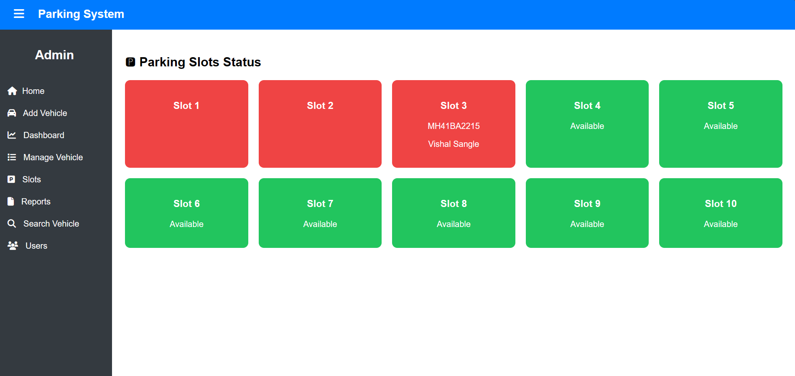
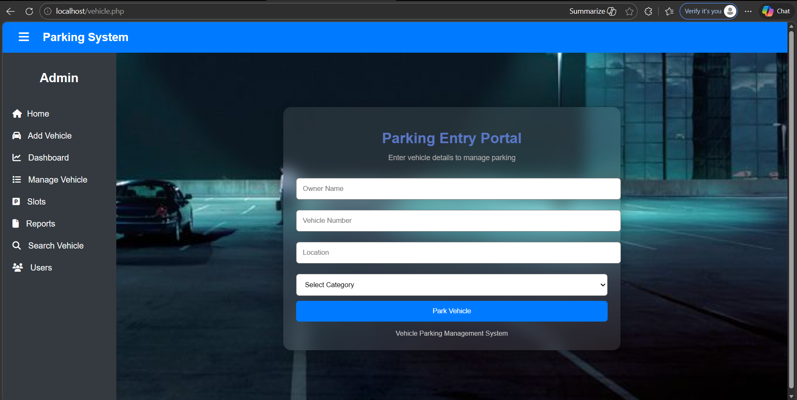
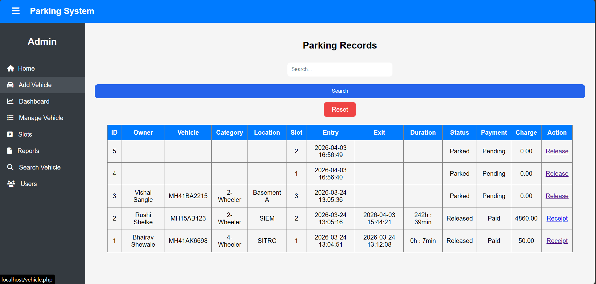

# 🚗 Vehicle Parking Management System

A web-based Vehicle Parking Management System developed using PHP and MySQL to manage parking slots efficiently.

---

## 📌 Features

- 🚘 Vehicle Entry & Exit Management  
- 🅿️ Automatic Parking Slot Allocation  
- 📊 Dashboard with Real-time Statistics  
- 💰 Parking Charge Calculation (Based on Time)  
- 🧾 Receipt Generation  
- 🔍 Search Vehicle Records  
- 📈 Reports (Daily / Monthly Earnings)  
- 🟢 Slot Availability Visualization  

---

## 🛠 Technologies Used

- Frontend: HTML, CSS  
- Backend: PHP  
- Database: MySQL  

---

## ⚙️ How It Works

1. User enters vehicle details  
2. System assigns available parking slot automatically  
3. Entry time is recorded  
4. On exit, system calculates parking duration  
5. Charges are generated based on vehicle type  
6. Receipt is generated  

---

## 💵 Pricing Logic

- 2-Wheeler → ₹20 per hour  
- 4-Wheeler → ₹50 per hour
  
---

## 📸 Screenshots

### 🏠 Home Page

### 📊 Dashboard

### 🅿 Slots

### 🚗 Add Vehicle Page

### 📋 Records Page

---

## 🚀 How to Run

1. Install XAMPP / WAMP  
2. Place project folder in `htdocs`  
3. Import database (`vehicle_db`) in phpMyAdmin  
4. Start Apache & MySQL  
5. Open browser:  

---

## 🎥 Demo

This project demonstrates real-time parking management including slot allocation, billing, and reporting.

---

## 📁 Project Structure

- index.php → Home page  
- vehicle.php → Add vehicle  
- insert.php → Insert data  
- view.php → View records  
- release.php → Exit vehicle & calculate charges  
- receipt.php → Generate receipt  
- report.php → Reports  
- search.php → Search system  
- db_config.php → Database connection  

---

## 🧠 What I Learned

- PHP & MySQL integration  
- CRUD operations  
- Real-time data handling  
- Backend logic implementation  
- UI design using CSS  
